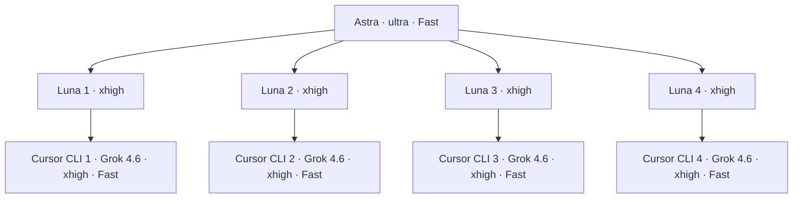

# Astra + 四个 Luna + 四个 Cursor CLI

用户在 2026-09-08 明确指定此架构，替换此前两个 Luna/high + Grok Build CLI，以及四个手动 Cursor 编辑器 Agent 的调度方式。此包只改变编排，不扩大 lightweight-workflow-v2 的 25 个产品路径、工作区、合同或当前返修范围。

编排层是五个 Codex Agent：一个 `gpt-6-astra / ultra / Fast` 主控，四个 `gpt-5.6-luna / xhigh` 控制器。执行层另有四个 Cursor CLI 会话，均要求 `grok-4.6 / xhigh / Fast`。Luna 管理进程、检查候选与回报；主要实现由对应 Grok 完成，最终语义验收由 Astra 完成。

## 配置与真实运行状态

- 本机主控默认配置已是 `gpt-6-astra`、`ultra`、`service_tier=priority`。Fast 是服务速度，不是推理强度。此项目设置保留这个组合。
- 项目 `.codex/config.toml` 请求 `agents.max_concurrent_threads_per_session=4`。当前官方字段不计主控，因此目标是 1+4；默认子模型/强度也显式固定。四个 `.codex/agents/lw_cursor_N.toml` 分别固定任务归属和 Luna/xhigh。
- 当前活跃对话的工具只提供 **4 个总并发位（包含主控）**。配置文件不能改变已加载的工具限制。新主控会话必须先核验至少能同时运行主控+四个子代理；不足时报告，不能用三个、嵌套子代理或四个外部 Codex 进程冒充达标。
- Cursor CLI 已安装（`2026.09.02-c22c1a3`），但预检时 `agent status --format json` 为 unauthenticated。完成 `agent login` 后，重新读取 `agent models` 并确认当前账户能使用要求的模型、xhigh 和 Fast，才能启动实现。
- 当前仅完成配置准备和只读预检。没有启动四个 Cursor 开发进程，也没有把配置解析成功当成五 Agent 已并发运行。

本项目应使用应用自带 Codex `0.153.4`，路径 `/Applications/ChatGPT.app/Contents/Resources/codex`。PATH 中另一个 `0.142.0` 不能解析本机已有的较新 features 配置；不要为此重写全局配置或静默升级。应用自带版本的 strict-config 检查已接受此次 agents 设置。

## 四路归属

| 控制器 | 既有 source 目录（相对仓库） | 当前工作 |
|---|---|---|
| lw_cursor_1 | `.work/parallel/lightweight-workflow-v2/terminal-1/source` | PDF 恢复与工作区诊断返修 |
| lw_cursor_2 | `.work/parallel/lightweight-workflow-v2/terminal-2/source` | r3 后剩余异常路径与临时文件清理 |
| lw_cursor_3 | `.work/parallel/lightweight-workflow-v2/terminal-3/source` | 工作流返修、Skill、正式交接 |
| lw_cursor_4 | `.work/parallel/lightweight-workflow-v2/terminal-4/source` | CLI/docs、精确集成与完整验证 |

最新产品状态先读 `artifacts/verification/manual-pdf-v1/lightweight-workflow-v2/architect-overall-r1/CURRENT.md`。若用户或 Architect 已产生更新的正式审查/候选，核对后接续，禁止盲目重做这里记录的旧返修。模型宿主迁移不复制整棵源码、不新建四套依赖环境、不覆盖已有冻结证据。

## 交接与验收

Astra 下发目标与精确允许路径 → Luna 启动本路 Cursor CLI → Grok 实现/测试/冻结 → Luna 检查实际 handoff/ready、hash、日志和范围 → Astra 独立审查 → 必要的同范围返修或交付。退出码 0、文本“完成”、单路绿色测试都不是最终验收。

T1/T2 可以同时运行。T3/T4 先做独立工作，再按原合同从冻结 `files/` 接收依赖；每个源码路径始终只有对应 Grok 一个写者。Luna 不代写产品实现，不私改合同，不绕过审批，不替自己管理的 Builder 发出 Architect 接受。

Git 继续串行。全部 Builder 停止写入、精确候选经 Astra 接受后，Astra 可以把四个既有 Luna 中的一位临时切为 Repo Steward，并发出有明确 head/base/目标的操作指令；这不是第六个常驻 Agent。仍是 draft PR → integration，不自行 merge、不写 main、不关闭人工 gate。

## 来源

- [Codex Subagents](https://learn.chatgpt.com/docs/agent-configuration/subagents)：四子代理字段、自定义 TOML 和模型/强度继承规则。
- [Codex 配置参考](https://learn.chatgpt.com/docs/config-file/config-reference)：service_tier，Fast 对应 priority。
- [Cursor Grok 4.6](https://cursor.com/docs/models/grok-4-6)：模型 ID、xhigh 与 Fast 能力；账户实际可用性另验。
- Cursor CLI 精确参数来自本机 `agent --help`/状态预检；见 artifacts 中的新预检记录。
